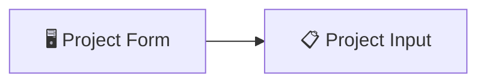
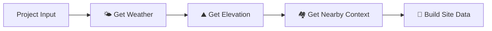
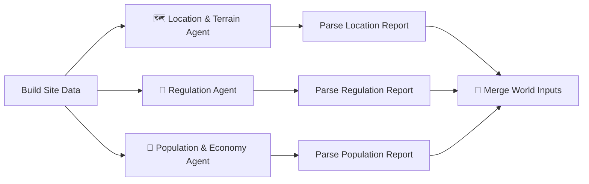
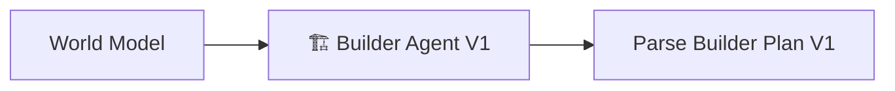
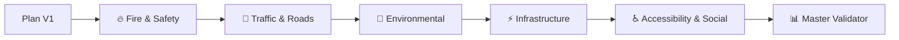
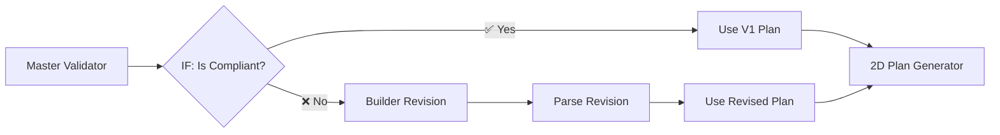

# Smart City Pipeline — Deep Analysis & Agent Refactoring Plan

## 1. How the Current Workflow Works (Full Breakdown)

### Overview
This is a **multi-agent smart-city planning pipeline** built entirely in n8n. Given a GPS location and project parameters, it automatically generates a complete urban development plan with 3D visualization and financial estimates — all powered by **real API data** and **Mistral AI agents**.

---

### Phase 1: User Input (Form Trigger)



| Node | What It Does |
|---|---|
| **Project Form** (`formTrigger`) | Web form collecting: Region name, Latitude, Longitude, Site width/length (m), Population estimate, Budget (USD), Notes |
| **Project Input** (`set`) | Normalizes form fields into clean variable names (`latitude`, `longitude`, `region_name`, etc.) and injects the **Mistral API key** + model name (`mistral-large-latest`) |

**Why**: The form is the entry point. The `set` node standardizes field names so every downstream node can reference them consistently via `$('Project Input').first().json.*`.

---

### Phase 2: Real-World Data Enrichment (Sequential HTTP Calls)



> [!IMPORTANT]
> These 3 nodes are the ones you want to convert into **Agent Tools**. Here is exactly what each one does with **real data**:

#### 🌤️ Get Weather — `api.open-meteo.com`
- **API**: Open-Meteo (free, no key needed)
- **URL**: `https://api.open-meteo.com/v1/forecast?latitude={lat}&longitude={lon}&current_weather=true&daily=temperature_2m_max,temperature_2m_min,precipitation_sum,windspeed_10m_max&timezone=auto`
- **Returns real data**: Current temperature, wind speed, wind direction, weather code, plus 7-day daily forecasts (max/min temp, precipitation, max wind speed)
- **Why**: Climate data directly affects building design (wind loads, drainage, HVAC requirements) and construction scheduling

#### ⛰️ Get Elevation — `api.open-elevation.com`
- **API**: Open Elevation (free, no key)
- **URL**: `https://api.open-elevation.com/api/v1/lookup?locations={lat},{lon}`
- **Returns real data**: Elevation in meters above sea level for the exact coordinates
- **Why**: Elevation determines flood risk, drainage engineering, foundation requirements, and terrain classification

#### 🏘️ Get Nearby Context — `overpass-api.de` (OpenStreetMap)
- **API**: Overpass API (OpenStreetMap query engine, free)
- **URL**: `https://overpass-api.de/api/interpreter?data=[out:json][timeout:25];(node[place~"city|town"](around:50000,{lat},{lon}););out body 20;`
- **Returns real data**: Up to 20 cities/towns within a 50km radius, with names and place types
- **Has retry logic**: 3 retries with 3-second waits, `onError: continueRegularOutput` (graceful degradation)
- **Why**: Nearby settlements affect transport planning, population growth projections, regional infrastructure connections

#### 🔧 Build Site Data — Code Node (Aggregator)
Merges ALL upstream data into a single `site_data` JSON object:
```json
{
  "location": { "latitude", "longitude", "region_name", "elevation_m" },
  "site": { "width_m", "length_m", "area_m2", "notes" },
  "weather": { "current": {...}, "daily": {...} },
  "nearby_settlements_50km": [{ "name", "place_type" }],
  "demographics": { "population_estimate" },
  "budget_usd": number
}
```

---

### Phase 3: Parallel AI Analysis (3 Mistral Agents)



| Agent | Input | Output (JSON) | Temperature |
|---|---|---|---|
| **Location & Terrain** | Full `site_data` | `site_classification`, `terrain_summary`, `climate_summary`, `regional_context`, `opportunities[]`, `constraints[]` | 0.3 |
| **Regulation** | `region_name` only | `max_building_height_m`, `min_road_width_m`, `min_green_space_pct`, `hospitals_per_10000_pop`, `schools_per_5000_pop`, `parking_spaces_per_unit`, `disclaimer` | 0.2 |
| **Population & Economy** | `demographics` only | `projected_growth_pct_10yr`, `housing_units_needed`, `transport_demand_level`, `regional_cost_multiplier`, `notes` | 0.3 |

**Why parallel**: These 3 analyses are independent. They fan out from `Build Site Data` and merge back at `Merge World Inputs` (a 3-input position-based merge).

**"Assemble World Model"** then combines everything into a single `world_model` JSON.

---

### Phase 4: City Plan Generation



The Builder Agent receives the full `world_model` and produces:
- **Districts** (id, name, purpose, area percentage)
- **Buildings** (hospitals, schools, residential units, commercial m²)
- **Road hierarchy**, utilities plan, green space %, transport plan
- **Graph edges** (relationship network between districts)

---

### Phase 5: Sequential Validation Chain (5 Validators)



> [!NOTE]
> The validators run **sequentially** (chained), not in parallel. Each one checks the plan against good-practice norms AND the regulation constraints. Each returns `{ validator_name, is_compliant, score_pct, issues[] }`.

**Master Validator** aggregates all 5 reports:
- Computes `overall_score_pct` (average of 5 scores)
- Sets `is_compliant = true` only if ALL validators pass
- Collects all issues into one flat list

---

### Phase 6: Compliance Decision & Revision



- **If compliant**: Uses the original plan as-is
- **If not compliant**: Sends the plan + issues list back to Mistral for a corrective revision, then uses the revised plan
- Both paths converge into the 2D Plan Generator

---

### Phase 7: Visualization & Financial Output

```mermaid
graph LR
    G2D["2D Plan Generator"] --> P2D["Parse 2D Plan"]
    P2D --> G3D["3D Massing Generator"]
    G3D --> P3D["Parse 3D Massing"]
    P3D --> FIN["Financial Agent"]
    FIN --> PFR["Parse Financial Report"]
    PFR --> FMR["Final Master Report"]
    FMR --> BRP["Build Report Page"]
    BRP --> SR["Show Report"]
```



| Stage | What It Produces |
|---|---|
| **2D Plan** | Flat list of placed objects with `x_pct`, `y_pct`, `width_pct`, `height_pct` relative positions |
| **3D Massing** | Adds `floors`, `height_m`, `building_type` to each object |
| **Financial Agent** | Cost breakdown (buildings, roads, utilities, green space, contingency), within-budget check, construction phases |
| **Final Master Report** | Assembles everything into one JSON |
| **Build Report Page** | Generates a full **interactive HTML page** with Three.js 3D city model, financial tables, district tables, and raw JSON dump |
| **Show Report** | Returns the HTML as a downloadable binary file via the form completion page |

---

## 2. The Current Problem for Presentation

The current flow runs the 3 data-enrichment HTTP calls (`Get Weather → Get Elevation → Get Nearby Context`) as a **rigid sequential chain**:

```
Project Input → Get Weather → Get Elevation → Get Nearby Context → Build Site Data
```

**Issues for presentation clarity:**
1. **Looks like a "dumb" pipeline** — just HTTP nodes chained together, no intelligence in the data-gathering phase
2. **Not clear WHY** these 3 calls exist — an audience sees "HTTP Request" boxes and doesn't understand their purpose
3. **No autonomy** — the data gathering can't adapt (e.g., skip elevation if it already has it, retry a different weather API)

---

## 3. Proposed Refactoring: Convert to Agent Tools

> [!IMPORTANT]
> **Logic stays 100% the same.** Same APIs, same URLs, same data. We just wrap them as tools that a **single "Site Data Collector" AI Agent** can call.

### What Changes

#### CURRENT (Prototype):
```
Project Input → Get Weather → Get Elevation → Get Nearby Context → Build Site Data → ...
```
**4 sequential nodes** before the AI agents even start.

#### PROPOSED (Agent-based):
```
Project Input → 🤖 Site Data Collector Agent → Build Site Data → ...
                   ├── 🔧 Tool: Get Weather
                   ├── 🔧 Tool: Get Elevation
                   └── 🔧 Tool: Get Nearby Context
```
**1 AI Agent node** with 3 tool sub-nodes + the existing Build Site Data.

### How It Works in n8n

The n8n **AI Agent** node (`@n8n/n8n-nodes-langchain.agent`) supports connecting **tools** as sub-nodes. For each HTTP call, we use the **HTTP Request Tool** node (`@n8n/n8n-nodes-langchain.toolHttpRequest`) which lets the agent call URLs dynamically.

Each tool would be configured with:

| Tool | Name & Description for Agent | URL Template | 
|---|---|---|
| **Get Weather** | "Fetches current weather and 7-day forecast for given latitude/longitude from Open-Meteo" | `https://api.open-meteo.com/v1/forecast?latitude={lat}&longitude={lon}&current_weather=true&daily=...` |
| **Get Elevation** | "Looks up the elevation in meters above sea level for given coordinates from Open Elevation API" | `https://api.open-elevation.com/api/v1/lookup?locations={lat},{lon}` |
| **Get Nearby Context** | "Queries OpenStreetMap Overpass API for cities and towns within 50km of the given coordinates" | `https://overpass-api.de/api/interpreter?data=...` |

The **Agent's system prompt** would be:
> "You are a Site Data Collector. Given project coordinates (latitude, longitude), use your tools to gather: (1) weather data, (2) elevation data, (3) nearby settlement context. Call all three tools, then return the combined results as JSON."

The **Mistral Cloud Chat Model** (`@n8n/n8n-nodes-langchain.lmChatMistralCloud`) connects as the agent's LLM.

### Why This Is Better for Presentation

| Aspect | Before (Prototype) | After (Agent Tools) |
|---|---|---|
| **Visual clarity** | 4 opaque HTTP boxes in a chain | 1 Agent node with 3 clearly labeled tools |
| **Narrative** | "We call 3 APIs in sequence" | "An AI agent autonomously gathers site intelligence using 3 real-data tools" |
| **Presentation wow-factor** | Low — looks like basic automation | High — demonstrates **agentic AI** with tool use |
| **Data** | Same real APIs, same real data | Same real APIs, same real data |
| **Logic** | Unchanged | Unchanged — `Build Site Data` still aggregates identically |
| **Extensibility story** | Adding a new API = rewiring the chain | Adding a new API = adding a tool to the agent |

---

## 4. Nodes Involved in the Change

### Nodes to REMOVE from the main flow
- `Get Weather` (HTTP Request)
- `Get Elevation` (HTTP Request)
- `Get Nearby Context` (HTTP Request)

### Nodes to ADD
- **Site Data Collector Agent** (`@n8n/n8n-nodes-langchain.agent`) — main agent node
- **Mistral Cloud Chat Model** (`@n8n/n8n-nodes-langchain.lmChatMistralCloud`) — LLM sub-node for the agent
- **HTTP Request Tool: Get Weather** (`@n8n/n8n-nodes-langchain.toolHttpRequest`) — tool sub-node
- **HTTP Request Tool: Get Elevation** (`@n8n/n8n-nodes-langchain.toolHttpRequest`) — tool sub-node
- **HTTP Request Tool: Get Nearby Context** (`@n8n/n8n-nodes-langchain.toolHttpRequest`) — tool sub-node

### Nodes UNCHANGED
- `Project Form` → `Project Input` (same)
- `Build Site Data` (same code, just receives agent output instead of chained HTTP outputs — minor expression update)
- ALL downstream nodes (Mistral agents, validators, builders, generators, report) — **100% unchanged**

### Connection Changes
```diff
- Project Input → Get Weather → Get Elevation → Get Nearby Context → Build Site Data
+ Project Input → Site Data Collector Agent → Build Site Data
+                  ├── (sub) Mistral Cloud Chat Model
+                  ├── (sub) HTTP Request Tool: Get Weather  
+                  ├── (sub) HTTP Request Tool: Get Elevation
+                  └── (sub) HTTP Request Tool: Get Nearby Context
```

---

## 5. Verification Plan

### Automated Test
- Use the n8n MCP `test_workflow` tool to execute the updated workflow with real coordinates (e.g., Sousse, Tunisia: lat=35.8254, lon=10.6084)
- Verify the `Build Site Data` output still contains: `location.elevation_m`, `weather.current`, `weather.daily`, `nearby_settlements_50km[]`

### Manual Verification
- Open the workflow in n8n cloud UI and confirm the visual layout
- Verify the 3D report HTML still generates correctly with real data
- Compare output JSON structure with the prototype's output

---

## Open Questions

> [!IMPORTANT]
> **Mistral API Credential**: The current workflow hardcodes the Mistral API key in the `Project Input` set node. For the new Agent node's Mistral Cloud Chat Model sub-node, should I:
> - (A) Use the same hardcoded key approach (pass it via header in a raw HTTP call)?
> - (B) Create/use an n8n Credential for Mistral (cleaner, but requires credential setup in n8n Cloud)?

> [!IMPORTANT]
> **Build Site Data update**: The `Build Site Data` code node currently reads from named upstream nodes like `$('Get Weather').first().json`. After the refactor, it will need to read from the Agent's output. Should I:
> - (A) Have the Agent output pre-merged site_data directly (agent handles the merge)?
> - (B) Keep Build Site Data but adjust it to parse the Agent's structured output?
